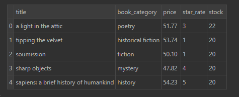

# 1.0. Introdução ao exercício

Como exercicio para treinamento das tecnicas de Webscraping usando BeautifulSoup, irei fazer a coleta das principais informações de cada livro do site [https://books.toscrape.com/](https://books.toscrape.com/)

# 2.0. Planejamento da solução

## 2.1. Produto final:

Uma tabela contendo as seguintes informações sobre os livros: titulo, categoria, preço, avaliações e disponibilidade em estoque.

## 2.2. Processo:

- Acessar o site books to scrape
- Coletar os dados dos livros na vitrine, pagina por pagina
- Acessar cada produto unicamente e coletar os detalhes de cada um
- Juntar todas as informações em um CSV e limpar os dados para termos as informações completas sobre os livros

## 2.3. Ferramentas:

- Python 3.9.12
- Pycharm
- Jupyter Notebook
- BeautifulSoup

# 3.0. Conclusão:
<h1></h1>